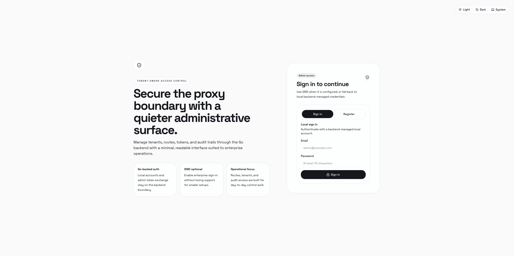
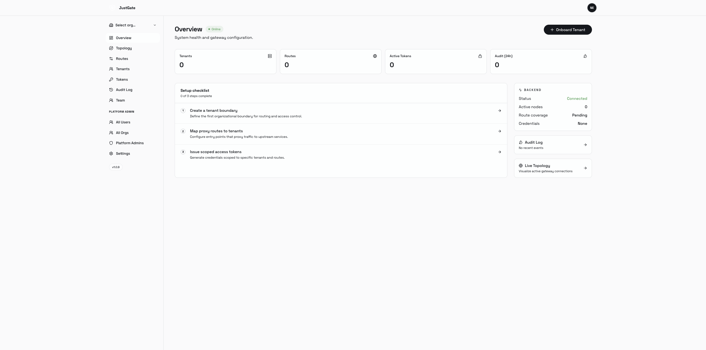
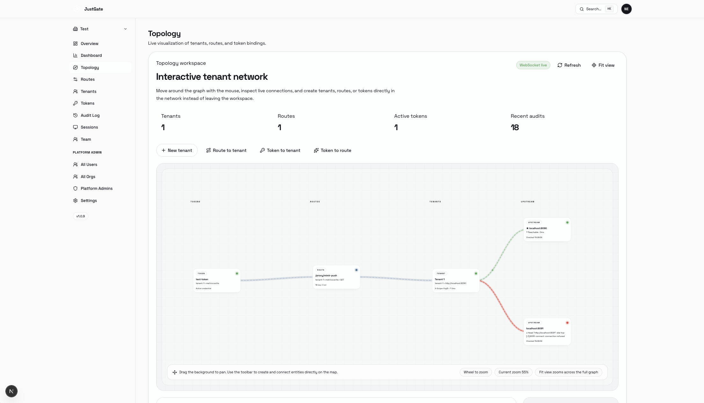
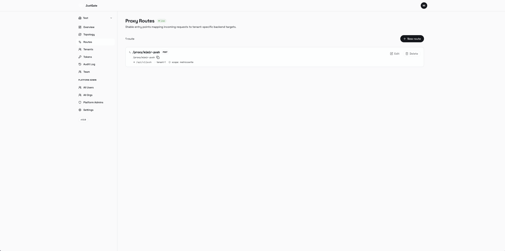
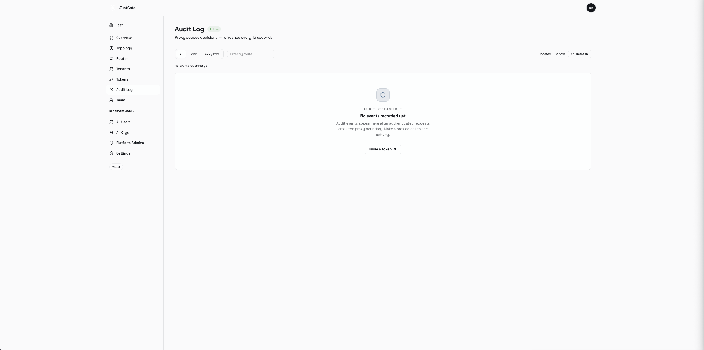
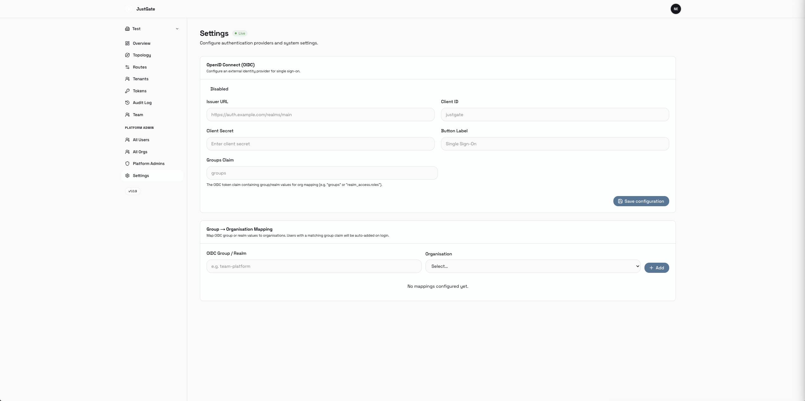

<div align="center">


# JustGate

**Multi-tenant proxy gateway with an admin UI**

Route authenticated bearer tokens to upstream services, inject tenant identity headers, enforce rate limits and IP policies, and audit every request — all managed through a self-hosted web interface. Proxy any upstream behind OIDC browser login or bearer-token auth with the Protected Apps feature.

[](LICENSE)
[](services/backend/go.mod)
[](services/frontend/package.json)

</div>

---

## Table of Contents

- [Overview](#overview)
- [Features](#features)
- [Screenshots](#screenshots)
- [Architecture](#architecture)
- [Quick Start](#quick-start)
- [Documentation](#documentation)
- [Contributing](#contributing)
- [License](#license)

---

## Overview

JustGate sits in front of any HTTP upstream (Grafana Mimir, Loki, Tempo, custom APIs, …) and enforces multi-tenant access control via scoped bearer tokens. An organisation admin manages tenants, routes, and tokens through a web UI; remote clients authenticate with those tokens and JustGate proxies their requests to the correct upstream — injecting the configured tenant identity header, enforcing rate limits, filtering by IP, and tripping circuit breakers when the upstream is unhealthy.

```
Client (bearer token)
    │
    ▼
┌────────────────────────────────────────────────┐
│  JustGate  (/proxy/{slug}/…)                   │
│                                                │
│  1. IP allow/deny check                        │
│  2. Token validation (scope, expiry, active)   │
│  3. Rate limiting (per-route or per-token)     │
│  4. Circuit breaker                            │
│  5. Proxy  →  inject tenant identity header    │
│  6. Record audit + traffic stat                │
└────────────────────────────────────────────────┘
             │  X-Scope-OrgID: <tenant-id>
             ▼
     Upstream service
```

---

## Features

### Core proxy
- **Multi-tenancy** — unlimited tenants, each with their own upstream URL and identity header value
- **Scoped bearer tokens** — fine-grained scopes per route; expiry, revocation, and per-token rate limits
- **Slug-based routes** — stable `GET /proxy/{slug}/…` entry points mapped to tenant + upstream path
- **Method allowlisting** — restrict which HTTP methods a route accepts
- **IP allow / deny lists** — per-route CIDR allowlists and denylists (IPv4 and IPv6)
- **Rate limiting** — configurable requests-per-minute (RPM) and burst; defined at route level or token level; Redis-backed or in-memory
- **Circuit breaker** — automatically stops forwarding to unhealthy upstreams and recovers when they come back
- **Load balancing** — multiple weighted upstream URLs per tenant with primary/replica designation

### Observability
- **Audit log** — every proxied request recorded with method, status, upstream URL, and latency; paginated
- **Traffic analytics dashboard** — 5-minute bucketed request volume, error rate, and average latency charts with 24 h / prior 24 h comparison; all gateway-rejected requests (429, 403, 502) are included in the stats
- **Upstream health checks** — periodic reachability checks per tenant with history; latency tracking
- **Live topology map** — WebSocket-streamed interactive graph of tokens → routes → tenants → upstreams; edges turn red within 30 seconds of an error and clear automatically; animated packet flow on active traffic
- **Route tester** — built-in HTTP client in the admin UI with route/token selectors, auto-filled URL, `Authorization` header injection, and a live cURL command preview with one-click copy

### Protected Apps
- **Browser-authenticated upstream proxy** — protect any HTTP service with OIDC single sign-on; users log in once and are proxied transparently
- **Machine-to-machine access** — issue scoped bearer tokens for CI/CD pipelines, scripts, or service accounts
- **Four auth modes** — `oidc` (browser OIDC), `bearer` (M2M token), `any` (either), `none` (passthrough, IP rules only)
- **IP allow / deny lists** — per-app CIDR filtering applied before any authentication check
- **Rate limiting** — configurable RPM and burst; keyed per session, per IP, or per token
- **Identity header injection** — forward user email, sub, name, or groups to the upstream as custom headers
- **Custom CA support** — trust self-signed or internal CA certificates per app
- **Health check path** — JustGate probes the upstream and reflects status in the UI
- **Redirect rewriting** — 3xx redirects from the upstream are automatically rewritten to stay within the proxy path

### Administration
- **Organisation management** — multi-org support with invite links and member roles
- **Platform Admin** — superadmin role with cross-organisation visibility: manage all users, orgs, and platform admin grants
- **OIDC org mappings** — auto-assign users to organisations based on OIDC group claims
- **Auth flexibility** — local accounts (email + password) and/or OIDC single sign-on
- **Session management** — view and revoke active admin sessions

### Operations
- **Persistence** — SQLite (zero-config, default) or PostgreSQL
- **Zero-downtime schema migrations** — versioned migrations run automatically on startup
- **Single binary backend** — one Go binary, no external runtime dependencies beyond the database
- **Helm chart** — monolithic (single pod, SQLite) or microservice (split pods, PostgreSQL) deployment modes

---

## Screenshots

| Sign-in | Overview | Topology |
|---------|----------|----------|
|  |  |  |

| Routes | Audit Log | Platform Admin |
|--------|-----------|----------------|
|  |  |  |

### Live Topology Demo

> Click the image below to watch the topology demo video.

[](docs/screenshots/topology.mp4)

---

## Architecture

```
services/
├── backend/          Go control plane & proxy runtime
│   ├── cmd/server/   Binary entry point
│   └── internal/
│       └── service/  HTTP handlers, store, migrations, auth
└── frontend/         Next.js admin UI
    ├── app/          App Router pages & API routes
    ├── components/   UI components (HeroUI v3 / Tailwind v4)
    └── lib/          Auth helpers, backend client, type contracts
```

**Request flow (admin UI):**
1. Admin signs in via OIDC or local credentials → NextAuth session
2. Next.js API routes mint a short-lived signed JWT and forward admin calls to the Go backend
3. Go validates the JWT, authorises the operation, and persists changes

**Request flow (proxy runtime):**
1. Client sends `GET /proxy/{slug}/…` with a `Bearer <token>` header
2. Go checks IP allowlist/denylist, validates the token (scope, expiry, active state), enforces rate limits, and checks the circuit breaker
3. The upstream request is forwarded with the tenant identity header injected
4. Response is streamed back; an audit record and a 5-minute traffic stat bucket are written asynchronously

---

## Quick Start

### Prerequisites

| Tool | Version |
|------|---------|
| Go | ≥ 1.22 |
| Node.js | ≥ 22 |
| pnpm | ≥ 9 |
| Docker | ≥ 24 *(for container builds)* |

### Local Development

```bash
# Backend (SQLite auto-selected)
cd services/backend
JUST_GATE_BACKEND_JWT_SECRET=dev-secret go run ./cmd/server
```

```bash
# Frontend
cd services/frontend && pnpm install
cat > .env.local <<'EOF'
NEXTAUTH_SECRET=dev-secret
NEXTAUTH_URL=http://localhost:3000
JUST_GATE_BACKEND_URL=http://localhost:9090
JUST_GATE_BACKEND_JWT_SECRET=dev-secret
JUST_GATE_LOCAL_ACCOUNTS_ENABLED=true
JUST_GATE_LOCAL_REGISTRATION_ENABLED=true
EOF
pnpm dev
```

Open `http://localhost:3000` and register the first admin account.

### Docker (single container)

```bash
docker build -t justgate:latest .
docker run -d \
  -p 3000:3000 -p 9090:9090 \
  -v justgate-data:/data \
  -e NEXTAUTH_SECRET=change-me \
  -e NEXTAUTH_URL=http://localhost:3000 \
  -e JUST_GATE_BACKEND_JWT_SECRET=change-me \
  --name justgate justgate:latest
```

For Docker Compose and PostgreSQL setups, see the **[Quick Start wiki page](../../wiki/Quick-Start)**.

---

## Documentation

Full documentation lives in the [project wiki](../../wiki):

| Topic | Wiki page |
|---|---|
| Local dev, Docker, Docker Compose | [Quick Start](../../wiki/Quick-Start) |
| All environment variables | [Configuration](../../wiki/Configuration) |
| Kubernetes / Helm deployment | [Deployment](../../wiki/Deployment) |
| Rate limiting, IP filtering, auth modes | [Route & Token Configuration](../../wiki/Route-and-Token-Configuration) |
| Traffic analytics, topology map, route tester | [Observability](../../wiki/Observability) |
| Browser-auth proxy, per-app examples | [Protected Apps](../../wiki/Protected-Apps) |
| OIDC setup, Keycloak, troubleshooting | [OIDC / Single Sign-On](../../wiki/OIDC-Single-Sign-On) |
| Platform admin bootstrap & capabilities | [Platform Admin](../../wiki/Platform-Admin) |
| Full REST endpoint reference | [API Reference](../../wiki/API-Reference) |
| How to contribute | [Contributing](../../wiki/Contributing) |

---

## Contributing

Contributions are welcome! See the [Contributing wiki page](../../wiki/Contributing) for a full guide.

Quick steps:
1. Fork and create a feature branch
2. Make changes and add tests
3. `cd services/backend && go test ./...`
4. `cd services/frontend && pnpm build`
5. Open a PR against `main`

---

## License

JustGate is released under the [Business Source License 1.1](LICENSE).

**In short:**

- **Free** for non-commercial use, internal tooling, research, and open-source projects
- **Commercial license required** for use in any product or service operated by a for-profit organisation
- The license converts to [Apache 2.0](https://www.apache.org/licenses/LICENSE-2.0) on **11 March 2030**

For commercial licensing enquiries, please contact **kontakt@justlab.app**.

